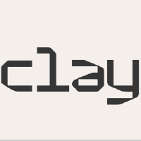
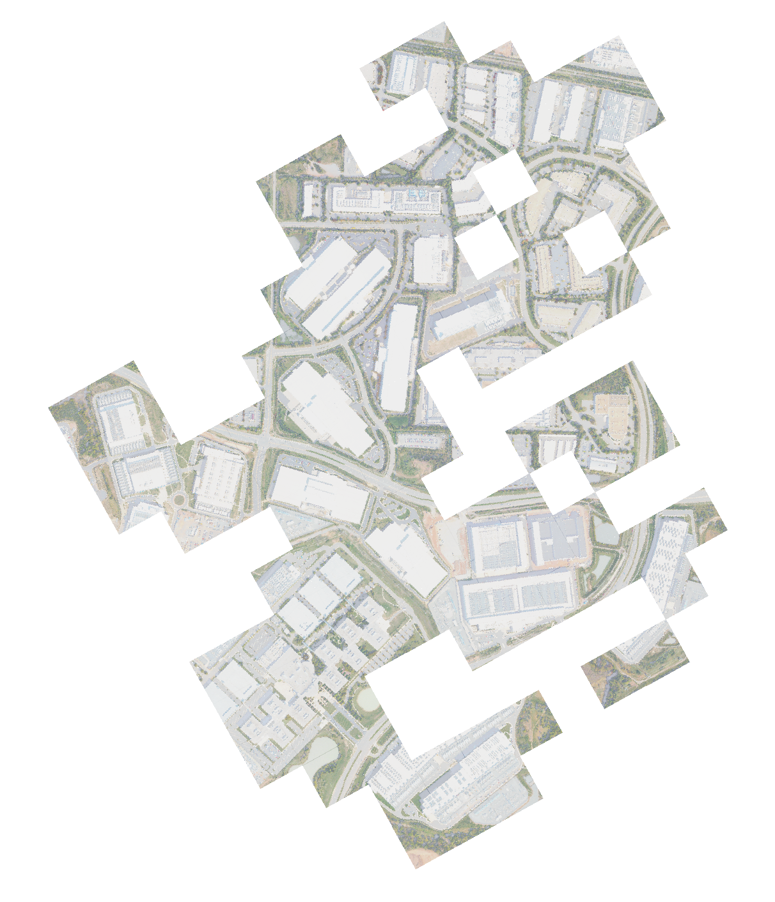

# Data Center Detector?

A semantic segmentation model for detecting data centers in aerial imagery using [Clay AI](https://madewithclay.org/) ? ...well, not actually.




## Summary (a salvage operation)

Clay AI is made for "earth observation" and, their [website](https://madewithclay.org/) shows a few examples with man-made structures (livestock), so I wondered if I could train it to detect hyperscale data centers.

This is essentially a segmentation problem, where we need to differentiate "data centers" from other structures in an image. Ideally, I'd get a polygon + Lat/Lon centroid too.

### **Unfortunately, Clay didn't work for this data center segmentation experiment**

***If someone out there has any tips for how to make Clay AI work for this task, please let me know 🙃***

The Clay [model](https://github.com/Clay-foundation/model) includes a segmentation example using Chesapeake Bay wetlands, which works because Clay's encoder was trained with 311M params of earth-centric features (vegetation, water bodies, agricultural patterns, etc.). It was able to do segmentation on land types, because it "knows" about the feature boundaries. 

However, the model fails on segmentation of data centers because the features are not among its parameters:
- Rectangular industrial buildings with distinctive rooftops
- Cooling infrastructure patterns (chillers, cooling towers)
- Electrical substation arrangements
- Uniform spacing and geometric layouts

>  **Fine-tuning using some data center polygons against the frozen encoder was simply not a good match for the model to learn to recognize "alien" data center features.**

The results using Clay were bad:
- Best attempt: 37% IoU with balanced weights
- Worst attempt: 0.5% recall with Focal Loss (predicted almost nothing)


***see the "Gory Details" section for full details***

### Classification worked but that wasn't my objective

An early iteration used a chip-level classifier that predicted whether a 256×256 pixel image chip contained a data center. While this worked for binary classification, it had critical limitations:

- **No precise localization**: Could only say "data center exists in this 256×256 area" but not where exactly
- **Poor centroid accuracy**: Center of the chip is not the same as center of the data center
- **No polygon extraction**: Couldn't determine data center boundaries or actual footprint
- **Coarse granularity**: 256×256 pixels at 0.6m resolution = ~154m × ~154m area

For applications requiring precise lat/lon coordinates (e.g., mapping data center locations on a map), this chip-level approach was inadequate.


## Forcing a solution with U-Net

This project went through several iterations before settling on the current U-Net architecture. Understanding this evolution helps explain design decisions and avoid repeating failed approaches.

The final approach switched to **U-Net trained from scratch** with just 2.5M trainable parameters. You might get better results with other image libraries; I just wanted to verify that _something_ worked better than my failed Clay attempts.

## U-Net Model Performance

Trained on 757 NAIP chips (256×256 pixels, 0.6m resolution):

| Metric     | Score  |
|------------|--------|
| Dice Score | 76.3%  |
| IoU        | 61.7%  |
| Precision  | 75.9%  |
| Recall     | 76.7%  |

**Model Architecture:**
- U-Net with 4 encoder/decoder levels
- 32 base channels
- ~2.5M trainable parameters
- Input: 4-band RGBN imagery
- Output: Binary segmentation (datacenter/background)

**Why it (finally) worked:**
- All parameters trainable and optimized for data center detection
- Simpler architecture better suited to specialized task
- Faster training (minutes instead of hours)
- No dependency on pre-trained weights that may not transfer well

**Results:**
- **Dice Score: 76.3%** (F1-score for segmentation)
- **IoU: 61.7%** (Intersection over Union)
- **Precision: 75.9%** (few false positives)
- **Recall: 76.7%** (finds most data centers)

>  This represents a **2-3× improvement** over the best Clay model results (37% IoU → 62% IoU) while being faster to train and easier to maintain.

### Key Takeaway

For specialized detection tasks with limited training data:
- **Domain-specific training from scratch** often outperforms transfer learning from general-purpose foundation models
- **Smaller, focused models** can outperform larger pre-trained models when the pre-training task doesn't align well
- **Frozen encoders** are a major limitation when the pre-trained features don't match the target task

## Project Structure

```
clay-ai-hyperscale/
├── src/
│   └── datacenter_detector/
│       ├── __init__.py
│       ├── models/
│       │   ├── __init__.py
│       │   └── unet.py              # U-Net model architecture
│       ├── data/
│       │   ├── __init__.py
│       │   ├── dataset.py           # PyTorch Dataset
│       │   └── datamodule.py        # Lightning DataModule
│       └── utils/
│           └── __init__.py
├── bin/
│   ├── train.py                      # Train model
│   ├── detect.py                     # Single image inference
│   ├── batch_detect.py               # Batch inference on chips
│   ├── download_naip.py              # Download NAIP imagery
│   └── create_masks.py               # Generate training masks from GeoJSON
├── checkpoints/
│   └── unet_last.ckpt                # Latest checkpoint
├── data/
│   ├── chips/                        # Training image chips (256x256)
│   ├── masks/                        # Training segmentation masks
│   ├── validation/                   # Validation visualizations
│   └── datacenters.geojson           # Label polygons
├── tests/                            # Unit tests
├── predictions/                      # Inference outputs
├── results/                          # Result outputs
├── test_images/                      # Test imagery
├── outputs/                          # Training outputs
├── pyproject.toml                    # Project dependencies
└── README.md                         # This file
```

## Installation

### Prerequisites
- Python 3.12+
- CUDA-capable GPU (optional, but recommended)
- Apple Silicon Mac with MPS support (optional)

### Install with uv (recommended)

```bash
# Clone repository
git clone <repository-url>
cd datacenter-detector

# Install dependencies
uv sync

# Activate virtual environment
source .venv/bin/activate  # Unix/macOS
# or
.venv\Scripts\activate     # Windows
```

### Install with pip

```bash
pip install -e .
```

## Quick Start

### 1. Download NAIP Imagery

```bash
uv run python bin/download_naip.py \
    --lat 40.06513 \
    --lon -82.74859 \
    --size 2560 \
    --output imagery/ohio_datacenter.tif
```

### 2. Detect Datacenters

```bash
uv run python bin/detect.py \
    --checkpoint checkpoints/unet_last.ckpt \
    --image imagery/ohio_datacenter.tif \
    --output-geojson results/datacenters.geojson \
    --output-mask results/prediction_mask.tif
```

### 3. View Results

Open `results/datacenters.geojson` in QGIS or any GIS software to see detected datacenter centroids with areas.

## Training

### Prepare Training Data

1. **Place NAIP chips** in `data/chips/`
2. **Create GeoJSON** with datacenter polygons
3. **Generate masks**:

```bash
uv run python bin/create_masks.py \
    --chips-dir data/chips \
    --geojson labels/datacenters.geojson \
    --output-dir data/masks \
    --buffer 7.5
```

### Train Model

```bash
uv run python bin/train.py \
    --chips-dir data/chips \
    --masks-dir data/masks \
    --batch-size 16 \
    --epochs 30 \
    --lr 0.001 \
    --output-dir outputs/training_run_1
```

**Training on different hardware:**
- **CUDA GPU**: Automatically detected
- **Apple Silicon (MPS)**: Automatically detected
- **CPU**: Fallback (very slow)

## Usage Examples

### Detect with Custom Parameters

```bash
uv run python bin/detect.py \
    --checkpoint checkpoints/unet_last.ckpt \
    --image test.tif \
    --output-geojson results/output.geojson \
    --min-area 200 \              # Minimum area in pixels
    --merge-distance 15 \         # Merge polygons within 15m
    --tile-size 256 \             # Tile size for processing
    --overlap 32                  # Overlap between tiles
```

### Batch Processing on Training Chips

```bash
uv run python bin/batch_detect.py \
    --checkpoint checkpoints/unet_last.ckpt \
    --chips-dir data/chips \
    --output-geojson results/batch_results.geojson \
    --merge-distance 50
```

### Download Larger Area

```bash
uv run python bin/download_naip.py \
    --lat 40.065 \
    --lon -82.748 \
    --size 5120 \                 # 5120x5120 pixels
    --output large_area.tif
```


## Inference Features

### Automatic Tiling
- Handles images of any size
- 256×256 tiles with 32px overlap
- Majority voting in overlapping regions

### Polygon Processing
- Merges nearby predictions (default: 10m)
- Filters small detections (default: 100 pixels)
- Removes edge artifacts (50px buffer)
- Skips nodata/padded regions

### Output Formats
- **GeoJSON**: Datacenter centroids with lat/lon coordinates
- **GeoTIFF**: Binary segmentation mask
- **CSV**: Tabular data (via GeoJSON conversion)

## Known Limitations

1. **NAIP-specific**: Trained on 0.6m NAIP imagery, performance may vary on other imagery types
2. **4-band input**: Requires RGBN (Red, Green, Blue, NIR) bands
3. **Resolution dependent**: Best performance at ~0.3-1m resolution
4. **Edge effects**: Small detections near image edges may be false positives
5. **US-only**: NAIP imagery only covers the United States


## Acknowledgments

- Training data: NAIP imagery via Microsoft Planetary Computer
- Architecture: U-Net (Ronneberger et al., 2015)
- Framework: PyTorch Lightning


---
### Gory Details: Failed Segmentation Attempts with Clay Foundation Model

The next approach attempted to use the Clay Foundation Model, a 311M parameter pre-trained model for Earth observation. The idea was to leverage transfer learning by fine-tuning only the decoder head while keeping the encoder frozen.

**Multiple training runs all failed:**

1. **CrossEntropyLoss with class weights 1.0:5.0** (15 epochs)
   - IoU: ~7-15%
   - Model barely learned anything

2. **CrossEntropyLoss with class weights 1.0:3.0** (15 epochs)
   - IoU: ~10-20%
   - Slight improvement but still poor

3. **CrossEntropyLoss with balanced class weights 1.0:1.0** (15 epochs)
   - IoU: ~25-37%
   - Better but still far from usable
   - Training data was ~48% data center pixels, so balanced weights made sense

4. **Focal Loss** (specialized loss for class imbalance)
   - Recall: 0.5%
   - Model predicted almost nothing as data center
   - Worse than CrossEntropyLoss

**Root cause**: The frozen Clay encoder (311M parameters) was pre-trained on generic Earth observation tasks and couldn't adapt to data center-specific features. The small decoder head alone (~2M parameters) couldn't compensate.

### Why Not Unfreeze the Encoder?

The [Clay segmentation documentation](https://github.com/Clay-foundation/model/blob/main/docs/finetune/segment.md) explicitly uses a frozen encoder approach for their official segmentation fine-tuning workflow. Their tutorial trains on Chesapeake Bay land cover classification (forests, water, urban areas, etc.) with the encoder frozen, using only a lightweight segmentation head.

**Why frozen encoder works for Clay's LULC task:**
- Land cover classification (forests, water, buildings) is very similar to Clay's pre-training objectives
- The encoder already learned these general Earth observation features during pre-training
- Only the segmentation head needs to learn class boundaries
- Uses very low learning rate (1e-5) appropriate for frozen encoder fine-tuning

**Why frozen encoder failed for data center detection:**
- Data centers are highly specialized structures with specific architectural features:
  - Rectangular industrial buildings with distinctive rooftops
  - Cooling infrastructure patterns
  - Electrical substation arrangements
  - Different from natural land cover features
- Clay's pre-training focused on general Earth observation (agriculture, forests, water bodies, etc.)
- The frozen encoder couldn't extract data center-specific features
- Small decoder head alone couldn't compensate for missing feature representations

**Why we didn't unfreeze:**
- Risk of catastrophic forgetting of pre-trained features
- Requires massive amounts of training data to retrain 311M parameters
- Very slow training on available hardware (CPU/MPS)
- High risk of overfitting with only 757 training chips
- Even if it worked, would negate the benefit of using a pre-trained model


---
### BONUS: check out this crazy cluster of (mostly) data centers in VA:


***The NAIP chips that I used to digitize datacenters.geojson were too big to include in this repo (163M); reach out if you would like them. See data/datacenters.geojson for more details.***
